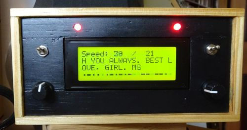

# Arduino-Morse-Code-Decoder

Using a microphone module connected to an Arudio nano, recieved pulses of morse code are convereted to plain text and and displayed on a 20x4 LCD module. 

Speed adjustment is set by a potentiometer to the sending speed of the morse or alternatively the unit can be set to automatic mode. While auto mode attempts to track the speed, manual mode usually gives the best results.

The set length (in words per minute) and the actual speed of the last receved dot are displayed on the top line of the LCD display. The second and third line display the most recent characters of received morse in plain text. The bottom line displays the the most recent morse displayed as dots and dashes.

There are other morse code to text decoders online. This is unlikely to be the best. It's just the result of a challenge I set myself.

More details of the project are available on my blog [garrysblog.com](https://garrysblog.com)

Author Garry Edmonds

## Status
### What works
 - Manual mode with clear signal
 - Automatic speed tracking when there is not a large speed variation between transmitted signals, that is when the speed changes by more than 2

### What doesn't
 - When the infoming signal is noisy
 - When there is significant differences between the length of characters and gaps. Where it is long gaps between characters display.

## Useful links used to develop this project
Thanks to everyone that provides information online. For this project the resources were particulalry useful.

### Libraries
 - I2C LCD display library https://github.com/fdebrabander/Arduino-LiquidCrystal-I2C-library
 - Faster LCD library hd44780 used in the final version. Info https://forum.arduino.cc/index.php?topic=470153.0 Library https://github.com/duinoWitchery/hd44780
 - Info about hd44780 at duinoWitchery https://www.hackster.io/fmattiussi/how-to-use-a-hd44780-based-display-7ac730
    and here https://fluxworkshop.com/blogs/getting-started/lets-workshop-20x4-lcd-module-and-i2c-adapter
 
### Morse code specifications
 - Morse code specifications https://en.wikipedia.org/wiki/Morse_code
 - Morse code timing https://military.wikia.org/wiki/Morse_code
 - Calculating speed http://www.kent-engineers.com/codespeed.htm
 
### Filters
 - Low pass filters https://www.edn.com/a-simple-software-lowpass-filter-suits-embedded-system-applications/
    and https://www.electronics-tutorials.ws/filter/filter_2.html, http://www.learningaboutelectronics.com/Articles/Low-pass-filter-calculator.php
 - Band pass filters https://www.electronics-tutorials.ws/filter/filter_4.html
 - More filtering https://www.megunolink.com/articles/coding/3-methods-filter-noisy-arduino-measurements/
 
### General Arduino
 - Dealing with a noisy interrupt signal https://forum.arduino.cc/index.php?topic=391811.30 and http://www.gammon.com.au/switches
 - About strings https://www.tutorialspoint.com/arduino/arduino_strings.htm
 - Connecting LEDs https://www.robotshop.com/community/forum/t/2-leds-on-only-one-output/31252/5
 - KY-037 module circuit diagram http://arduinolearning.com/code/ky038-microphone-module-and-arduino-example.php
 
### Morse examples for testing
  - Titanic Text Messages - A Streaming Log of Distress Transmissions https://www.youtube.com/watch?v=FxRN2nP_9dA
  - 100 most common English words in Morse Code @25wpm https://www.youtube.com/watch?v=j_39X3w947c
  - "The Bell Tone" by Edmund H Leftwich - 18 WPM Morse Code https://www.youtube.com/watch?v=O8wOa2SNspQ
  - Generate practice morse up to 50 wpm http://aa9pw.com/morsecode/
  - Real online short-wave receiver located at the amateur radio club ETGD at the University of Twente - http://websdr.ewi.utwente.nl:8901/
